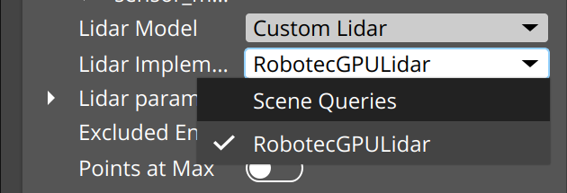
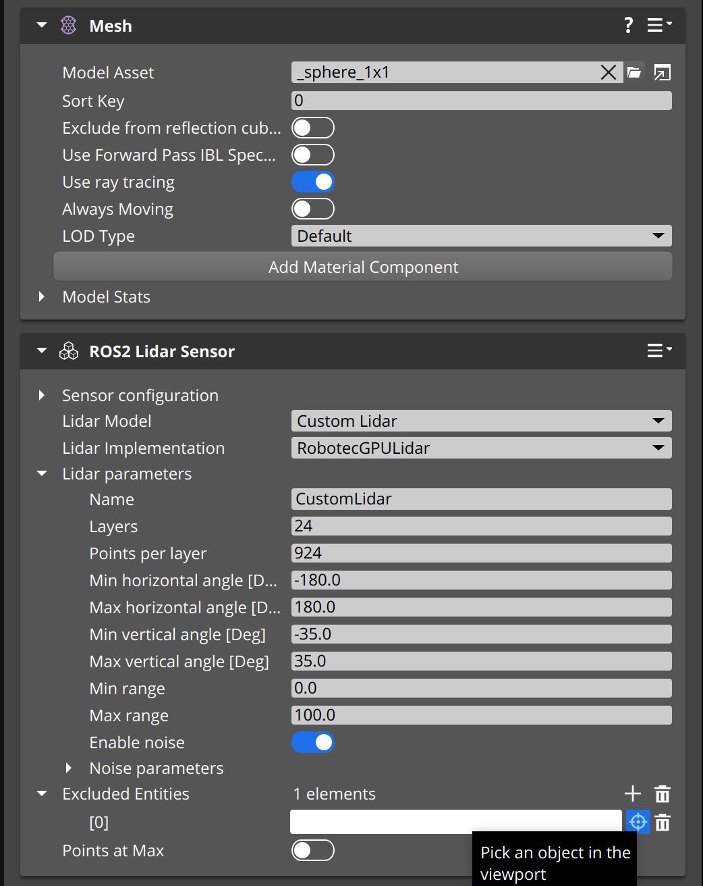

# Robotec GPU Lidar (RGL) Gem for Open 3D Engine (O3DE)

This project enables GPU-accelerated LIDAR simulation for robotics.

## A bit of context

* [Open 3D Engine](https:://o3de.org) - an open source game & simulation engine. O3DE is extendable through modules
  called Gems. This is one of such Gems.
* [LIDAR](https://en.wikipedia.org/wiki/Lidar) - a type of active sensor used in robotics, emitting and receiving back
  laser beams.
* [Robot Operating System (ROS)](https://docs.ros.org/en/rolling/index.html) - an open source middleware and de facto
  standard for robotics.
* [ROS2 Gem](https://github.com/o3de/o3de-extras/tree/development/Gems/ROS2) - an open source module for O3DE which
  enables simulation for robotics using modern ROS.
* [Robotec GPU Lidar](https://github.com/RobotecAI/RobotecGPULidar) - an open source library for simulating LIDAR
  through raycasting based on GPU with CUDA and OptiX.

## Description

The O3DE Robotec GPU Lidar Gem is a module working
with [O3DE ROS2 Gem](https://github.com/o3de/o3de-extras/tree/development/Gems/ROS2) and extending it with a fast and
scalable LiDAR implementation by making use of the [Robotec GPU Lidar](https://github.com/RobotecAI/RobotecGPULidar)
library.

## Features

Combined with the O3DE ROS2 Gem's `Lidar Sensor Component` the O3DE RGL Gem allows for creation of a configurable,
high - performance LiDAR. The Gem provides a faithful representation of the simulated environment by supporting the
following visuals:

- Mesh Component
- Terrain created using the O3DE Terrain Gem
- Actor Component

and providing the following features:

- Gaussian Noise
- Point cloud intensity data


You can fully customize the LiDAR's settings using the O3DE Level Editor. Those include properties like:

- configurable raycasting pattern
- lidar range
- entities excluded from raycasting
- lidar noise

You can also choose one of the presets provided by the ROS2 Gem to create a LiDAR model that fits your needs.


## Requirements

- [
  **Runtime requirements** of the Robotec GPU Lidar.
  ](https://github.com/RobotecAI/RobotecGPULidar#runtime-requirements)
- Any O3DE project with the [O3DE ROS2 Gem](https://github.com/o3de/o3de-extras/tree/development/Gems/ROS2) enabled.
- The following ROS2 packages installed on your system:
    - `cyclonedds`,
    - `fastrtps`,
    - `radar-msgs`.

  You can install those packages with the following commands:
  ```bash
  sudo apt install -y ros-${ROS_DISTRO}-cyclonedds ros-${ROS_DISTRO}-rmw-cyclonedds-cpp
  sudo apt install -y ros-${ROS_DISTRO}-fastrtps ros-${ROS_DISTRO}-rmw-fastrtps-cpp
  sudo apt install -y ros-${ROS_DISTRO}-radar-msgs
  ```

***IMPORTANT:*** *You do not need to download or set up the RobotecGPULidar library itself and only have to meet
the **RUNTIME** requirements.*

## Setup

1. **Clone the Gem's repository.**
    ```bash
    git clone https://github.com/RobotecAI/o3de-rgl-gem.git
    ```
2. **Switch to the correct branch.** \
   Depending on which version of O3DE and ROS2 gem you use this step may differ.
   Below is a table of supported build combinations:

   | o3de-rgl-gem               | [o3de/o3de-extras](https://github.com/o3de/o3de-extras) | [Robotecai/o3de-extras](https://github.com/robotecai/o3de-extras) | [o3de](https://github.com/o3de/o3de) |
   | -------------------------- | ------------------------------------------------------- | ----------------------------------------------------------------- | ------------------------------------ |
   | development branch         | development branch                                      | N/A                                                               | development branch                   |
   | development branch         | N/A                                                     | rgl/stable-dev branch                                             | Release 2310.3                       |
   | main branch, O3DE_2409 tag | Release 2409.x                                          | N/A                                                               | Release 2409.x                       |
   | main branch, O3DE_2310 tag | Release 2310.x                                          | N/A                                                               | Release 2310.x                       |

   **_Note:_** _This table describes build combinations that are guaranteed to work. There may exist other working build
   combinations._

3. **Register the Gem.** \
   You can either register the gem through the Command Line Interface or the O3DE Project Manager:
    - **CLI** \
      Head to your local O3DE engine directory (*o3de-dir*) and register the gem using its path (*gem-path*).
        ```bash
        cd <o3de-dir>
        ./scripts/o3de.sh register --gem-path <gem-path>
        ```
    - **Project Manager** \
      Open the Project Manager. Select **Gems -> Add Existing Gem**. Locate the gem's directory and select **Choose**.

4. **Enable the Gem in your project.** \
   Once again you can either enable it through the Command Line Interface or the O3DE Project Manager:

   ***Note:*** *Please, make sure to enable the ROS2 Gem first.*

    - **CLI** \
      In your local o3de engine directory you can enable the gem for your project (*project-path*).
        ```bash
        ./scripts/o3de.sh enable-gem -gn RGL -pp <project-path>
        ```
    - **Project Manager** \
      Open your project. Select **File -> Edit Project Settings -> Configure Gems**. Now, search for the Robotec GPU
      Lidar Gem and enable it.

## Usage

### Enabling and configuring the RobotecGPULidar implementation

1. **Create an entity with a `ROS2 Lidar Sensor` component.**

   Within your O3DE project add a new entity by right - clicking on the viewport and selecting **Create entity**.

    

   Select the newly created entity within the Entity Outliner. Next, within the Entity Inspector select
   **Add Component**.
   Then, search for `ROS2 Lidar Sensor` and add it to your entity using the left mouse button.

    

   ***Note:** You need to add the required `ROS2 Frame` component as well.*

2. **Select `RobotecGPULidar` as your LiDAR implementation.**

   In the Entity Inspector find the `ROS2 Lidar Sensor` component and change the **Lidar Implementation**
   to `RobotecGPULidar`.

    

   ***Note:** If you do not see the `RobotecGPULidar` implementation, please make sure you followed the **Setup**
   instructions correctly.*
3. **Customize your LiDAR.**

   After following through all previous instructions, you can customize the `ROS2 Lidar Sensor` component in the Entity
   Inspector to fit all your needs.

### Scene configuration

The RGL gem allows for global scene configuration. To achieve this:

1. **Add the ``RGL Scene Configuration`` component to the ``Level`` entity.**

   The Level entity is the root entity, and it can be found in the uppermost section of the Entity Outliner.
   In the Entity Inspector select **Add Component** . Then search for the ``RGL Scene Configuration`` component and add
   it to the entity.
2. **Customize the scene configurations.**

   In the Entity Outliner, under the ``RGL Scene configuration`` component parameters,
   you can customize the global scene configuration to fit your needs.

## Troubleshooting

### Issues related to the `libRobotecGPULidar.so` file

If you encounter any issues relating the `libRobotecGPULidar.so` file please follow these steps:

1. Make sure no files named `RGL_DOWNLOAD_IN_PROGRESS` exist inside the build directory of your project. This file prevents the Gem from downloading new binaries and may not be deleted if the O3DE project configuration was unexpectedly stopped.
2. If this didn't help, try removing the `RGL_VERSION_METADATA` and `ROS_DISTRO_METADATA` metadata files (also located under the build path). This will force the RGL gem to download required native RGL files.

For more details on how the RGL gem handles downloads of the native RGL library binaries and API source code, please refer to the [FindRGL.cmake](Code/FindRGL.cmake) file.

### Issues related to the in-game lidar behaviour

One common issue is when the lidar detects unwanted geometry as shown below.


You can fix this with the following steps:

1. Locate the `Excluded Entities` section in the `ROS2 Lidar Sensor` component properties.

   

2. Add a new excluded entity. You can select it in the Viewport or in the Entity Outliner.

   

The entity's name should appear in the Excluded Entities list (as seen on the image below).


### Other issues

If this section does not seem to help, feel free to post an issue on the gem's github
repository in which you describe the problem you are facing.
